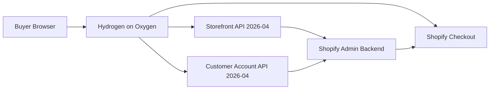

# Afterstate Architecture

Technical foundation for the Afterstate Hydrogen storefront.

**Stack (inspected):**

| Package | Version |
| --- | --- |
| `@shopify/hydrogen` | `2026.4.4` |
| Skeleton / project | `2026.4.5` |
| `react-router` | `7.16.0` |
| Storefront API | `2026-04` (Hydrogen default) |
| Customer Account API | `2026-04` (Hydrogen default) |
| Styling | CSS Modules + CSS custom properties |
| Markets URL strategy | Locale subfolders (`($locale)`) |
| Data source (foundation) | Mock.shop → Afterstate Shopify store |
| Hosting | Shopify Oxygen |

---

## 1. Overall system architecture



Afterstate is a custom Hydrogen storefront on Oxygen. Shopify remains the single commerce and content backend. Hydrogen owns presentation, interaction, SEO output, and caching policy. Checkout, payments, inventory, and order management never leave Shopify.

There is no second database, CMS, or custom payment backend.

---

## 2. Shopify responsibilities

Shopify Admin / platform manages:

- Products, variants, inventory, prices, discounts
- Customers, orders, Markets, currencies, taxes, shipping
- Policies, checkout, Shop Pay / accelerated checkout
- Menus, Pages, Blogs, Articles
- Metafields and metaobjects (editorial + product storytelling)
- URL redirects (via Admin + `storefrontRedirect` on 404)

---

## 3. Hydrogen responsibilities

The Oxygen app manages:

- Page layouts, navigation, search UI, cart UI, account UI
- Product / collection / campaign / journal / lookbook presentation
- Homepage section rendering from metaobjects
- SEO meta, canonicals, hreflang, robots, sitemap
- JSON-LD structured data
- Cache strategy for public catalog data
- Interaction logic and future motion layer
- Analytics event wiring behind consent

---

## 4. Route structure

Public commerce and content routes use optional locale prefixes via React Router `($locale)`:

| URL | Route file |
| --- | --- |
| `/` | `($locale)._index.tsx` |
| `/shop` | `($locale).shop.tsx` |
| `/collections` | `($locale).collections._index.tsx` |
| `/collections/:handle` | `($locale).collections.$handle.tsx` |
| `/products/:handle` | `($locale).products.$handle.tsx` |
| `/afterstate-001-no-rush` | `($locale).afterstate-001-no-rush.tsx` |
| `/journal` | `($locale).journal._index.tsx` |
| `/journal/:article` | `($locale).journal.$articleHandle.tsx` |
| `/blog` | `($locale).blog._index.tsx` |
| `/blog/:article` | `($locale).blog.$articleHandle.tsx` |
| `/lookbook/:handle` | `($locale).lookbook.$handle.tsx` |
| `/about` | `($locale).about.tsx` |
| `/philosophy` | `($locale).philosophy.tsx` |
| `/size-guide` | `($locale).size-guide.tsx` |
| `/care` | `($locale).care.tsx` |
| `/shipping-returns` | `($locale).shipping-returns.tsx` |
| `/contact` | `($locale).contact.tsx` |
| `/search` | `($locale).search.tsx` |
| `/account/*` | `($locale).account*.tsx` |
| `/cart` | `($locale).cart.tsx` |
| `/policies/:handle` | `($locale).policies.$handle.tsx` |
| `/sitemap.xml` | `($locale).[sitemap.xml].tsx` (+ typed pages) |
| `/robots.txt` | `[robots.txt].tsx` |

Locale validation lives in `($locale).tsx`. Invalid locales return 404.

### Redirects (planned)

| From | To |
| --- | --- |
| `/collections/all` | `/shop` |
| `/blogs` | `/blog` |
| `/blogs/journal` | `/journal` |
| `/blogs/journal/:handle` | `/journal/:handle` |
| `/blogs/blog` | `/blog` |
| `/blogs/blog/:handle` | `/blog/:handle` |
| `/pages/about` | `/about` |
| `/pages/philosophy` | `/philosophy` |
| `/pages/size-guide` | `/size-guide` |
| `/pages/care` | `/care` |
| `/pages/shipping-returns` | `/shipping-returns` |
| `/pages/contact` | `/contact` |

Prefer Shopify Admin URL redirects plus app-level redirects for IA aliases.

Avoid duplicate routes that serve the same purpose (e.g. do not keep both `/collections/all` and `/shop` as primary shop surfaces).

---

## 5. Component structure

```
app/components/
  primitives/     # Text, Stack, Grid, Container building blocks
  layout/         # SiteHeader, SiteFooter, PageContainer, AnnouncementBar
  navigation/     # LocaleAwareLink, Breadcrumbs, MainNavigation, SkipToContent
  commerce/       # Cart*, ProductPrice, VariantSelector, MarketSelector
  product/        # Gallery, BuyControls, metafield-driven storytelling blocks
  collection/     # Grid, filters, manifesto, chapter inserts
  content/        # Campaign, editorial, lookbook, journal, manifesto, quote
  search/         # Search form, results, predictive search
  account/        # Account nav and presentation helpers
  forms/          # Newsletter, contact, discount, shared field styles
  seo/            # Meta helpers and JSON-LD components
  feedback/       # Loading, empty, error, 404, sold-out states
app/sections/     # Homepage section registry (metaobject → component)
```

Rules:

- Separate route loaders (data) from presentational components
- Keep components small and single-purpose
- No premade UI kits (no shadcn, no ecommerce template kits)

---

## 6. GraphQL query structure

```
app/graphql/
  fragments/   # ProductCard, ProductDetail, CollectionDetail, Media, Money, Metafields
  queries/     # Route-level and shared queries
  mutations/   # Cart / customer mutations if not covered by Hydrogen helpers
```

Conventions:

- Prefer focused fragments; do not over-fetch
- Product metafields requested only on product detail (and card subset when needed)
- Metaobject queries for homepage, campaigns, lookbooks
- Run `shopify hydrogen codegen` after query changes
- Use Hydrogen `storefront.query` with explicit cache strategies

---

## 7. Shopify content model

### Standard resources

Products, variants, collections, menus, pages, blogs/articles, policies, markets, discounts, customers, orders.

### Product metafields (`custom` namespace)

Documented in `docs/CONTENT_MODEL.md` and `docs/SHOPIFY_SETUP.md`:

`subtitle`, `collection_number`, `fit`, `fit_notes`, `fabric`, `fabric_composition`, `fabric_weight_gsm`, `construction`, `measurements`, `model_information`, `design_story`, `care_instructions`, `size_guide`, `shipping_note`, `product_badge`, `editorial_media`, `related_products`, `complete_the_look`, `seo_title_override`, `seo_description_override`.

### Metaobjects

`campaign`, `collection_chapter`, `lookbook`, `editorial_story`, `size_guide`, `care_guide`, `material`, `homepage_section`, `quote`, `media_block`, `collection_manifesto`, `product_story`, `campaign_credit`.

Homepage is an ordered list of `homepage_section` entries rendered by a section registry. Collection campaign pages can bind to `campaign` + `collection_chapter` metaobjects while still using Shopify collections for products.

---

## 8. Caching strategy

| Data | Cache | Notes |
| --- | --- | --- |
| Catalog (products, collections, menus) | Storefront API cache helpers / short TTL | Public |
| Homepage / metaobjects | Cacheable public | Revalidate on publish via short TTL |
| Search results | Short / none for predictive | Noindex pages |
| Cart | Session-bound, no shared cache | Per buyer |
| Customer account / orders | **Never cache** | Private |
| Policies | Cacheable | Public |

Use Hydrogen caching APIs only for public Storefront data. Never put customer PII in shared caches.

---

## 9. Markets and localization strategy

- URL structure: `/` (default EN-US / primary market) and `/{lang}-{country}/...` e.g. `/en-gb/`, `/de-de/`
- Locale parsed in `app/lib/i18n.ts` via `getLocaleFromRequest`
- Storefront `@inContext(country, language)` applied by Hydrogen context `i18n`
- Manual MarketSelector in header/footer — never hide market choice behind silent geo detection alone
- Prepare for language expansion; English-first content at launch
- Regional shipping / policy differences via Shopify Markets + policy routes
- hreflang + canonical URLs generated in SEO layer

Details: `docs/MARKETS.md`.

---

## 10. SEO strategy

Reusable SEO system for titles, descriptions, canonicals, Open Graph, robots, alternates, breadcrumbs, pagination.

Noindex:

- Cart
- Account
- Internal search
- Duplicate filter parameter combinations
- Non-production deployments / preview hosts

Crawlable SSR for products, collections, navigation, and pagination.

Details: `docs/SEO_STRATEGY.md`, `docs/SEO_CHECKLIST.md`.

---

## 11. Structured-data strategy

JSON-LD components:

- Organization / OnlineStore
- WebSite (with SearchAction when appropriate)
- Product + offers / variants (ProductGroup where valid)
- BreadcrumbList
- Article
- CollectionPage where valid

Rendered server-side with page content. Validate against Google rich-result expectations before launch.

---

## 12. Analytics and cookie-consent strategy

- Use Hydrogen analytics + Shopify Customer Privacy (2026.4 backend consent mode)
- Do not load nonessential analytics before consent
- Keep analytics adapter replaceable (`app/lib/analytics`)
- Track: page, product, collection, search, add/remove cart, begin checkout, purchase (where supported), newsletter, market change

Details: `docs/ANALYTICS.md`.

---

## 13. Accessibility requirements

- Semantic HTML, correct heading hierarchy
- Skip to content, visible focus, keyboard navigation
- Accessible nav, drawers (focus trap + restore), forms, variant/size selectors
- Cart live region announcements
- `prefers-reduced-motion` respected
- Useful alt text; decorative images marked appropriately
- Neutral wireframe contrast meeting WCAG AA for text

Details: `docs/ACCESSIBILITY.md`.

---

## 14. Testing strategy

- Playwright: critical commerce and a11y flows (homepage, nav, collection, product, variants, cart, discount, checkout URL, search, predictive search, market change, keyboard, 404, sitemap, robots, product JSON-LD)
- Unit tests only where logic is non-trivial (money formatting, locale parsing, section registry, SEO helpers)
- CI: typecheck, lint, Playwright smoke

Do not assert meaningless static marketing copy.

---

## 15. Environment variables

| Variable | Purpose |
| --- | --- |
| `SESSION_SECRET` | Session signing |
| `PUBLIC_STORE_DOMAIN` | Shop domain |
| `PUBLIC_STOREFRONT_API_TOKEN` | Storefront token |
| `PRIVATE_STOREFRONT_API_TOKEN` | Private Storefront token (server) |
| `PUBLIC_STOREFRONT_ID` | Analytics shop id |
| `PUBLIC_CHECKOUT_DOMAIN` | Checkout / consent |
| `PUBLIC_CUSTOMER_ACCOUNT_API_CLIENT_ID` | Customer Account API |
| `PUBLIC_CUSTOMER_ACCOUNT_API_URL` | Customer Account API URL |
| `PUBLIC_SITE_URL` | Absolute canonical base (production) |

Local foundation may use Mock.shop defaults injected by Hydrogen CLI when not fully linked.

---

## 16. Deployment strategy

- Deploy to Shopify Oxygen via `shopify hydrogen deploy`
- Link storefront with `shopify hydrogen link`
- Pull env with `shopify hydrogen env pull`
- Preview deployments noindex
- Production domain + Markets configured in Shopify Admin

Details: `docs/DEPLOYMENT.md`.

---

## 17. Error-handling strategy

Professional UI states for:

- Product / collection / article not found (404)
- Network / Storefront API failure
- Empty cart / empty collection / no search results
- Invalid variant / sold out
- Unavailable market
- Checkout / auth failures

Never expose stack traces or internal errors to buyers. Log server-side.

---

## 18. Security considerations

- Checkout remains on Shopify
- Session cookies signed with `SESSION_SECRET`
- No custom payment capture
- Customer data uncached and over HTTPS
- CSP via Hydrogen defaults where applicable
- Do not commit secrets; use Oxygen env
- Validate locale prefixes; reject unknown markets with 404

---

## 19. Performance budget

Targets (documented fully in `docs/PERFORMANCE.md`):

| Metric | Budget |
| --- | --- |
| LCP | ≤ 2.5s (p75, mobile) |
| INP | ≤ 200ms |
| CLS | ≤ 0.1 |
| Initial JS (route) | Prefer ≤ 200KB gzipped critical |
| Hero image | Optimized Shopify CDN; width/height set; not lazy |
| Fonts | System/wireframe stack initially; later self-hosted, `font-display: swap` |
| Third parties | Deferred; consent-gated |

Prefer SSR, focused GraphQL, responsive `Image`, lazy below-fold media, no heavy animation libraries in this phase.

---

## 20. Future design and motion layer

This phase ships an art-directed **wireframe** system:

- Black / white / neutral greys
- One system sans-serif
- Strong spacing, sharp borders, minimal radius
- Real Afterstate IA and product information structure

Later, without rewriting commerce:

- Final typography and brand color tokens
- Photography and campaign art direction
- Motion system (2–3 intentional motions minimum for launch visual phase)
- Editorial product layouts beyond the neutral product structure

Tokens live in `app/styles/tokens.css` and must remain the single source for spacing, type scale, and neutrals.

---

## Proposed production file tree

```
app/
  assets/
  components/
    primitives/
    layout/
    navigation/
    commerce/
    product/
    collection/
    content/
    search/
    account/
    forms/
    seo/
    feedback/
  graphql/
    fragments/
    queries/
    mutations/
  lib/
    analytics/
    cache/
    consent/
    errors/
    markets/
    seo/
    context.ts
    fragments.ts
    i18n.ts
    session.ts
    ...
  routes/
    ($locale)._index.tsx
    ($locale).shop.tsx
    ($locale).collections._index.tsx
    ($locale).collections.$handle.tsx
    ($locale).products.$handle.tsx
    ($locale).afterstate-001-no-rush.tsx
    ($locale).journal._index.tsx
    ($locale).journal.$articleHandle.tsx
    ($locale).lookbook.$handle.tsx
    ($locale).about.tsx
    ($locale).philosophy.tsx
    ($locale).size-guide.tsx
    ($locale).care.tsx
    ($locale).shipping-returns.tsx
    ($locale).contact.tsx
    ($locale).search.tsx
    ($locale).cart.tsx
    ($locale).account*.tsx
    ($locale).policies*.tsx
    ($locale).[sitemap.xml].tsx
    [robots.txt].tsx
  sections/
  styles/
    tokens.css
    reset.css
    app.css
  root.tsx
  entry.client.tsx
  entry.server.tsx
  routes.ts
docs/
  ARCHITECTURE.md
  SHOPIFY_SETUP.md
  CONTENT_MODEL.md
  MARKETS.md
  SEO_STRATEGY.md
  SEO_CHECKLIST.md
  PERFORMANCE.md
  ACCESSIBILITY.md
  ANALYTICS.md
  DEPLOYMENT.md
tests/e2e/
README.md
ROADMAP.md
```

---

## Starter file disposition

### Retained (scaffolding / platform)

- `server.ts`
- `vite.config.ts`
- `react-router.config.ts`
- `env.d.ts`, `.graphqlrc.ts`, `eslint.config.js`, `tsconfig.json`
- `app/entry.client.tsx`, `app/entry.server.tsx`, `app/routes.ts`
- `app/lib/session.ts`, `app/lib/context.ts` (modified for i18n — already markets-aware)
- `app/lib/i18n.ts`, `app/lib/redirect.ts`, `app/lib/variants.ts`, `app/lib/search.ts`, `app/lib/orderFilters.ts`
- Customer Account route family (`($locale).account*`)
- Cart route actions / Hydrogen cart helpers
- Sitemap + robots route files (content customized)
- Codegen outputs (`storefrontapi.generated.d.ts`, `customer-accountapi.generated.d.ts`)

### Modified

- `app/root.tsx` — Afterstate meta, layout, analytics consent wiring
- `app/styles/app.css`, `reset.css` — wireframe system
- `app/lib/fragments.ts` — split toward `app/graphql/*` over time; metafields added
- Layout/header/footer/cart/search components → replaced by structured folders
- Product, collection, search, cart, blog/journal routes — Afterstate IA + wireframe UI
- `README.md` — Afterstate project docs
- `package.json` — name `afterstate`, Playwright scripts

### Replaced

- Starter homepage (`($locale)._index.tsx` UI)
- Starter `Header` / `Footer` / `PageLayout` / `Aside` visual chrome
- Generic `ProductItem` card presentation
- Starter product page layout chrome
- Demo marketing copy / Hydrogen branding in UI

### Deleted (or retired when superseded)

- `app/components/MockShopNotice.tsx` — replace with restrained env notice in docs/dev only (or minimal footer note)
- Unused starter assets that conflict with Afterstate branding
- Duplicate shop surfaces after `/shop` exists (`collections.all` becomes redirect)
- `guides/` cookbook leftovers if unused
- `CHANGELOG.md` skeleton changelog (optional retain for upstream reference)

---

## Stage gate

Stage 1 ends with this document. Subsequent stages implement the tree and replace the visible starter interface with a premium editorial wireframe, without changing the Shopify-as-backend architecture.
